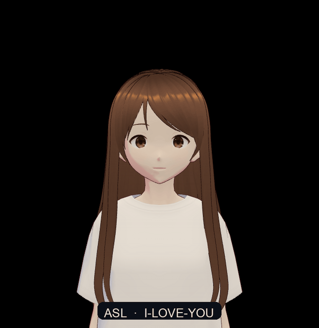
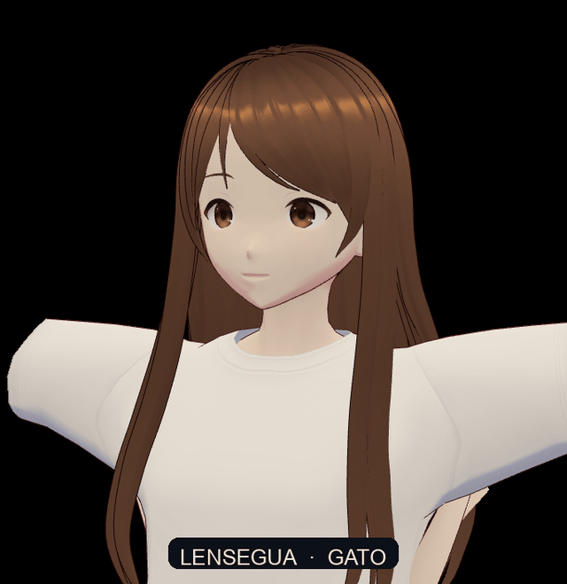

# Marionet

Compiling sign phonology onto portable VRM avatars.

## Abstract

Sign language production systems typically either bake a particular signer into pixels or bind motion to a studio-specific character. Neither yields a sign that a user-chosen avatar can perform. **Marionet** is a framework for isolated sign production whose primary artifact is *VRM gesture code*: retargetable bone and expression tracks that play on any VRM 1.0 humanoid, including a custom avatar dropped in at runtime.

Rather than regressing high-dimensional pose from text, Marionet compiles through a phonological intermediate representation (`SignDesc`) whose features — handshape, location, orientation, movement, and non-manuals — follow established sign phonology rather than a private latent. An expertise library of VRM-native primitives realizes those features as executable clips (`MarionetClip`). Learned models, when introduced, predict `SignDesc` and residual timing; they do not emit raw quaternions as a first language.

This repository begins with the runtime, the compiler, and a licensed isolated lexicon. The first authored set is American Sign Language fingerspelling (A–Z). Lexical `SignDesc` rows come from ASL-LEX 2.0 (OSF, CC BY 4.0) and SignPuddle ASL notation (official SPML dump). Most sign languages (EVK and the rest) are not written down: **video is the corpus**, and the experiment is to emit Marionet syntax from those clips. Photoreal signer video is a different task; we do not train diffusion.





Compiler demos (separate clips):

- **ASL I-LOVE-YOU** — `["I","L","Y"]` simultaneous at chest-front (ASL-LEX `I_love_you`). Replay: `http://localhost:8080/?demo=ily`
- **LENSEGUA GATO** — citation-form *sketch*: F-hand, cheek, whisker stroke, aligned with ASL-LEX `cat` (F / Head / CheekNose). No LENSEGUA dump is on the allowlist yet. Replay: `http://localhost:8080/?demo=gato`

Loop both with `http://localhost:8080/?demo=1`.

## This repository

| Path | Role |
|---|---|
| `index.html` | Player: load a VRM, type a letter, read the `SignDesc` |
| `src/ir.js` | `SignDesc` / `MarionetClip` schemas and validators |
| `src/library.js` | Parametric handshapes + VRM bone solver |
| `src/compile.js` | `SignDesc` → `MarionetClip` |
| `src/vrm.js` | Load, rest pose, apply clips |
| `data/signs/ase/fingerspelling.json` | A–Z as `SignDesc` |
| `data/signs/ase/asllex_signdesc.json` | ASL-LEX 2.0 → `SignDesc` (features only) |
| `dataingestplan.md` | License gate, disk cap, dump-only ingest |
| `paper/REGIME.md` | Research paper: video corpus → Marionet syntax |

```sh
python3 -m http.server 8080
# open http://localhost:8080
```

Drop a `.vrm` onto the stage, or use the bundled sample. Type A–Z.

## Video → Marionet syntax

The experiment: a clip of a signer in, `MarionetClip` JSON out. That JSON is what the VRM player already plays. No Stable Diffusion, no AnimateDiff, no signer identity.

```
allowed isolated-sign video
        → pose extract          (cloud GPU: DWPose + HaMeR)
        → marionet.pose/v0      (landmarks / MANO — not mp4)
        → geometric retarget
        → MarionetClip          (bone euler tracks)
        → drop onto index.html
```

SignVIP is the **pose tokenizer** standard (DWPose + HaMeR → discrete motion). We take that front-end and stop. Their diffusion decoder is irrelevant. `SignDesc` (`["I","L","Y"]`, location, movement) is a later head on the same pose tokens; v1 is playable clips from video.

**Compute.** Mac = player, IR, compiler. Rented GPU = HaMeR/DWPose (one 48GB card, batch 1, isolated clips). MediaPipe is the local stand-in so the path exists before you rent a box.

**Two files.** Pose JSON is the intermediate (`marionet.pose/v0`: fps, per-frame body + 21×2 hands, optional MANO). `MarionetClip` is the syntax (`marionet.clip/v0`, same schema `compile.js` already emits, `source: "retargeted"`). Keep videos and large pose dumps out of git.

**CLI (to be added):**

```sh
python scripts/video_to_marionet.py clip.mp4 --backend mediapipe -o data/clips/out.json
python scripts/video_to_marionet.py clip.mp4 --backend dwpose_hamer -o data/clips/out.json
```

Drop the JSON on the player the same way you drop a `.vrm`.

For languages without a spreadsheet (Estonian Sign Language / EVK / `eso`, and most of the world), this is the lexicon: video you are allowed to pose-extract, then syntax. No SpreadTheSign scrape in the job script.

The full experimental regime (supervision tiers, FSQ translator, E1–E5, metrics) is `paper/REGIME.md`.

## Data and licensing

Ingest follows `dataingestplan.md`. Official dumps only, 20 MB per file, no site mirrors, no SpreadTheSign, no Internet Archive as a licence.

| Now | What |
|---|---|
| ASL-LEX 2.0 OSF `signdata.csv` | 2,723 signs → `data/signs/ase/asllex_signdesc.json` (CC BY 4.0 files) |
| SignPuddle `sgn4.spml` | Gloss + FSW coverage; XML stays in gitignored `data/raw/` |
| v0 library map | Only existing solver IDs (`A`–`Y`, `1`, `neutral-space`). Unmapped codes stay as source phonology. |

462 ASL-LEX rows compile on today’s primitives (mapped handshape **and** Neutral location). The rest of the lexicon is data, not fake bone poses. Citations: `data/sources/CITATIONS.md`. Allowlist: `data/sources/allowlist.jsonl`.

```sh
python3 scripts/ingest_asllex.py
python3 scripts/ingest_signpuddle.py
```

## Status

- [x] VRM player, custom avatar drop, arms-down rest pose
- [x] `SignDesc` / `MarionetClip` v0
- [x] ASL fingerspelling expertise-library proof
- [x] License allowlist + ASL-LEX / SignPuddle dumps
- [ ] Location / orientation / movement catalogs beyond fingerspelling (`5`, `open_b`, Head, …)
- [ ] Video → pose → `MarionetClip` (MediaPipe local, DWPose+HaMeR on rented GPU)
- [ ] Pose tokens → `SignDesc` translator (no diffusion)
- [ ] Player: drop a retargeted `.json` clip
