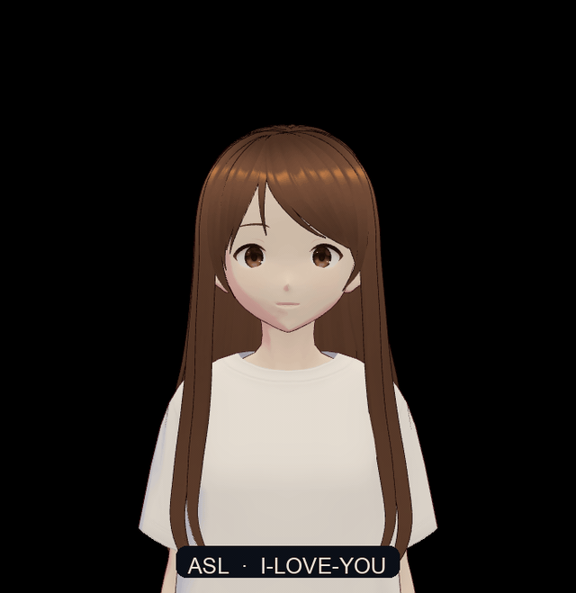
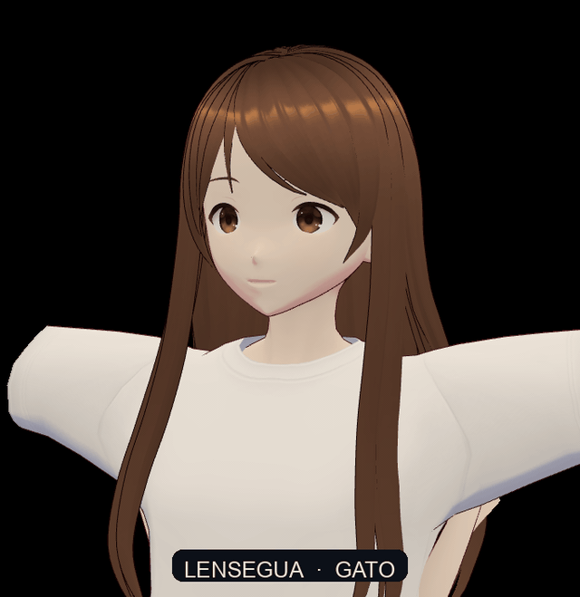

# Marionet

Compiling full-body sign (head, body, hands) onto portable VRM avatars.

## Abstract

Sign language production systems typically either bake a particular signer into pixels or bind motion to a studio-specific character. Neither yields a sign that a user-chosen avatar can perform. **Marionet** is a framework for isolated sign production whose primary artifact is *VRM gesture code*: retargetable bone and expression tracks that play on any VRM 1.0 humanoid, including a custom avatar dropped in at runtime. Portability is across VRM avatars, not arbitrary rigs.

The video task is **video → full body**, not video → manual phonology. A citation-form sign is head + torso + hands (and face). Geometric retarget always emits that whole humanoid. Discrete `SignDesc` labels the same three articulator groups. ASL-LEX’s spreadsheet is manual-heavy — that is a supervision gap, not the output. Hand-at-the-forehead is a place feature of the hand; it does not nod the neck. Both are required. Face (brows, mouth, gaze) compiles to VRM expression weights. Discourse grammar is out of scope because this paper is citation form, not because the body does not move. **A lemma is one sign.** Spoken English may take several words (`ILY` → “I love you”); that is a translation, not a parse of the gesture, not fingerspelling, and not three catalog entries. An expertise library of VRM-native primitives realizes those features as executable clips (`MarionetClip`). Learned models, when introduced, predict `SignDesc` and residual timing; they do not emit raw quaternions as a first language.

This repository begins with the runtime, the compiler, and a licensed isolated lexicon. The first authored set is American Sign Language fingerspelling (A–Z). Lexical `SignDesc` rows come from ASL-LEX 2.0 (OSF, CC BY 4.0) and SignPuddle ASL notation (official SPML dump). Most sign languages (EVK and the rest) are not written down: **video is the corpus**, and the experiment is to emit Marionet syntax from those clips. Photoreal signer video is a different task; we do not train diffusion.





Compiler demos (separate clips):

- **ASL ILY** — one citation-form sign (`ILY` handshape at chest-front). English “I love you” is a translation, not three signs. Replay: `http://localhost:8080/?demo=ily`
- **LENSEGUA GATO** — citation-form *sketch*: F-hand, cheek, whisker stroke, aligned with ASL-LEX `cat` (F / Head / CheekNose). No LENSEGUA dump is on the allowlist yet. Replay: `http://localhost:8080/?demo=gato`

Loop both with `http://localhost:8080/?demo=1`.

## This repository

| Path | Role |
|---|---|
| `index.html` | Dictionary player: search, language filter, drop a VRM or clip JSON |
| `src/ir.js` | `SignDesc` / `MarionetClip` schemas and validators |
| `src/library.js` | Parametric handshapes + VRM bone solver |
| `src/compile.js` | `SignDesc` → `MarionetClip` |
| `src/vrm.js` | Load, rest pose, apply clips |
| `data/signs/ase/fingerspelling.json` | A–Z as `SignDesc` |
| `data/signs/ase/asllex_signdesc.json` | ASL-LEX 2.0 → `SignDesc` (features only) |
| `dataingestplan.md` | License gate, disk cap, dump-only ingest |
| `paper/REGIME.md` | Research paper: video corpus → Marionet syntax |

```sh
python3 -m http.server 8080
# open http://localhost:8080
```

Drop a `.vrm` onto the stage, or use the bundled sample. Type A–Z.

## Video → Marionet syntax

The experiment: a clip of a signer in, `MarionetClip` JSON out. That JSON is what the VRM player already plays. No Stable Diffusion, no AnimateDiff, no signer identity.

```
allowed isolated-sign video
        → pose extract          (head/face + body + hands; per-hand conf)
        → marionet.pose/v0      (landmarks / MANO + conf — not mp4)
        → nucleus window        (prep | citation-form | retract)
        → geometric retarget    (full-body clip: spine, neck, head, arms, fingers, face)
        → SignDesc              (same three groups; unmapped/occluded, never forced)
        → MarionetClip          (compiler; optional finger residual)
        → drop onto index.html
```

SignVIP is the **pose tokenizer** standard (DWPose + HaMeR → discrete motion). We take that front-end and stop. Their diffusion decoder is irrelevant. v1 classifies `SignDesc` from pose features (`scripts/phonology.py`); FSQ and a VLM that emits the same JSON are ablations.

Video in is **head, body, and hands**. `SignDesc`’s hand layer is two-level: **features** (selected fingers, flexion, location, path) transfer; **names** (`ILY`, `open_b`) stay `unmapped` on L2/L3 until a linguist names the cluster. Head, torso, and face are induced from pose, not from ASL-LEX columns. HaMeR frames below confidence `τ_pose` become `occluded`; a weak class score becomes `unmapped` — never a forced nearest ASL label. Labels are read from the citation-form nucleus, not from preparation/retraction. Residual IK may correct finger bones only (`python/marionet/residual.py`); it must not rewrite the compiler’s arm, wrist, or axial pose.

**Compute.** Extract (Step A) is a **one-time** corpus cost on a rented 48GB GPU (days, corpus-size bound). Lookup — nucleus window, retarget, `SignDesc`, compile — is **near-real-time on a Mac**. MediaPipe is the local stand-in so the path exists before you rent a box. Do not quote GPU-days as per-sign inference.

**Two files.** Pose JSON is the intermediate (`marionet.pose/v0`: fps, per-frame body + 21×2 hands, optional MANO). `MarionetClip` is the syntax (`marionet.clip/v0`, same schema `compile.js` already emits, `source: "retargeted"`). Keep videos and large pose dumps out of git.

**CLI:**

```sh
python scripts/phonology.py setup
python scripts/video_to_marionet.py --backend dummy --lang eso --gloss KASS --phonology
python scripts/video_to_marionet.py clip.mp4 --backend mediapipe --lang eso --gloss KASS --phonology
python scripts/video_to_marionet.py --self-test
```

`setup` trains a linear pose→`SignDesc` classifier on synthetic L1 (ASL-LEX rows + fingerspelling). No torch. `--phonology` writes a sibling `.signdesc.json`; the player compiles it when `compileReady` is true. Geometric retarget always writes the clip. `dwpose_hamer` is the rented-GPU contract (same `marionet.pose/v0` schema), not an in-process backend yet. Drop the clip JSON on the player the same way you drop a `.vrm`. Pose JSON is not playable. Unmapped lemmas stay lexicon-only — the player will not invent a pose.

For languages without a spreadsheet (Estonian Sign Language / EVK / `eso`, and most of the world), this is the lexicon: video you are allowed to pose-extract, then syntax. No SpreadTheSign scrape in the job script.

The full experimental regime (supervision tiers, FSQ translator, E1–E5, metrics) is `paper/REGIME.md`.

## Data and licensing

Ingest follows `dataingestplan.md`. Official dumps only, 20 MB per file, no site mirrors, no SpreadTheSign, no Internet Archive as a licence.

| Now | What |
|---|---|
| ASL-LEX 2.0 OSF `signdata.csv` | 2,723 signs → `data/signs/ase/asllex_signdesc.json` (CC BY 4.0 files) |
| SignPuddle `sgn4.spml` | Gloss + FSW coverage; XML stays in gitignored `data/raw/` |
| v0 library map | Solver IDs including `5`, `open_b`, Head locations; unmapped codes stay source phonology |

2466 / 2723 ASL-LEX rows compile on today’s primitives (mapped handshape **and** location). The rest of the lexicon is data, not fake bone poses. Citations: `data/sources/CITATIONS.md`. Allowlist: `data/sources/allowlist.jsonl`.

```sh
python3 scripts/ingest_asllex.py
python3 scripts/ingest_signpuddle.py
```

## Status

- [x] VRM player, custom avatar drop, arms-down rest pose
- [x] `SignDesc` / `MarionetClip` v0
- [x] ASL fingerspelling expertise-library proof
- [x] License allowlist + ASL-LEX / SignPuddle dumps
- [x] Location / handshape catalogs past fingerspelling (`5`, `open_b`, Head, …); unmapped rows stay lexicon-only
- [x] Video → pose → `MarionetClip` CLI (`dummy` + local MediaPipe; DWPose+HaMeR is the GPU contract)
- [x] Player: search the polyglot lexicon, inspect `SignDesc`, drop a retargeted `.json` clip
- [x] Pose → `SignDesc` linear heads (`scripts/phonology.py`; FSQ/VLM are later ablations)
- [x] Pose confidence → `occluded` / class reject → `unmapped` (no forced argmax)
- [x] Nucleus window (prep / citation-form / retract) before `SignDesc`
- [x] Residual locked to finger IK (`python/marionet/residual.py`); macro-pose (including head/spine) stays compiled
- [x] Head / torso / face on `SignDesc` and on clips (axial bones + VRM expression presets)
- [ ] Per-avatar expression coverage check (missing presets stay silent)
- [ ] DWPose+HaMeR in-process backend on rented GPU (full body + conf + occluded)
